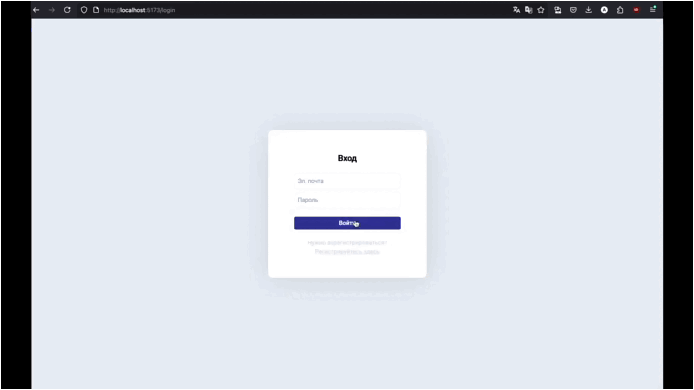
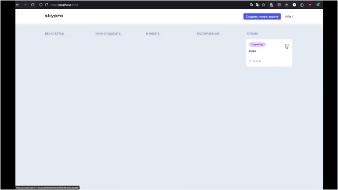
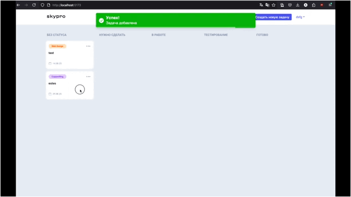
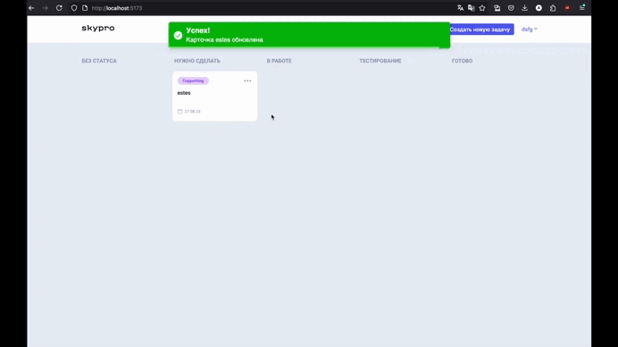

# Kanban 

```
start project

--> npm run dev
```

## Обзор проекта

Класическая 'Kanban' доска для создания и отслеживания задач.

1. Создание, редактирование, удаление задач
2. Drag and drop
3. Уведомления - для основных действий с задачами и ошибках
4. Смена темы (светлая / темная)

### Создание карточек



### Редактирование



### Dnd



### Смена темы

